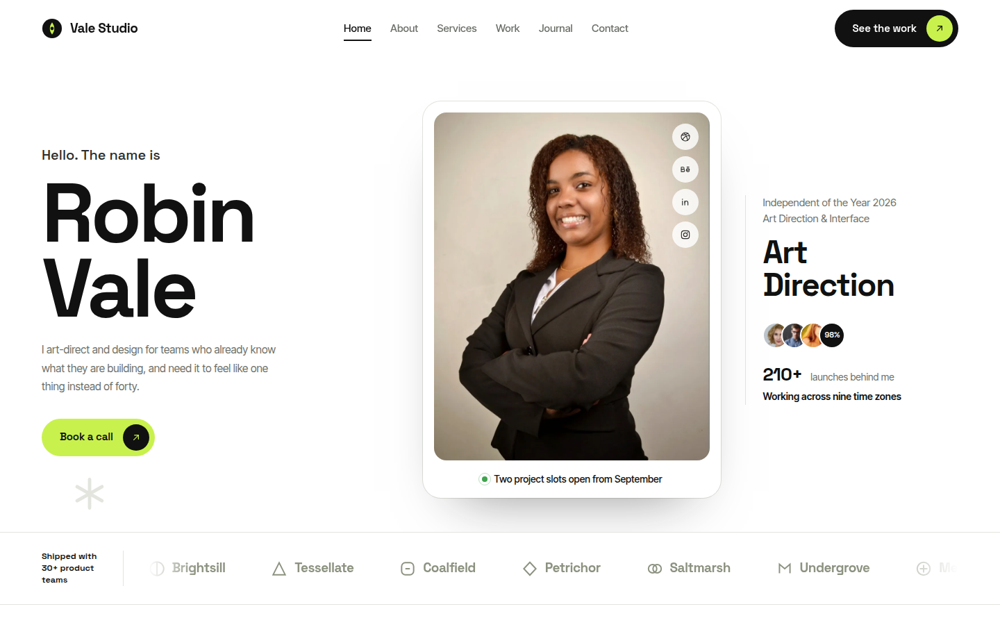

# SWP Freelancer Portfolio

A fast, accessible Astro portfolio theme for freelance art directors, designers
and small studios. Case studies, services, a journal, testimonials and an FAQ —
built as static HTML with a few kilobytes of vanilla JavaScript and no UI
framework.



## Demo

**https://swp-freelancer-portfolio.vercel.app/**

Source: [github.com/Scintillaweb/swp-freelancer-portfolio](https://github.com/Scintillaweb/swp-freelancer-portfolio)

## Features

- **Astro 7, static output.** Every route is prerendered. No adapter, no server.
- **No UI framework.** Astro components, plain CSS, and roughly 5 KB of vanilla
  JavaScript on the heaviest page — about 2 KB over the wire.
- **Twelve page routes** — home, about, services (index + detail), work
  (index + case study), journal (index + article), contact, privacy, terms and
  a custom 404 — plus `rss.xml`, `robots.txt` and a sitemap. The demo content
  builds out to 27 pages.
- **Content collections** for projects, services and journal posts, with typed
  frontmatter schemas and draft support.
- **One config file.** Name, role, contact details, social links and SEO
  defaults all live in `src/config/site.ts`.
- **Case studies** with results figures, client facts, services, tooling and a
  next-project link.
- **Journal** with categories, tags, reading time, an RSS feed and BlogPosting
  structured data.
- **Filterable work grid** built from the categories actually in use, with an
  `aria-live` result count.
- **Accessible by construction** — skip link, visible focus rings, a native
  `<details>` accordion, a keyboard-operable nav drawer, one `h1` per page and
  a palette checked against WCAG AA.
- **Works without JavaScript.** Content renders, the accordion opens, and the
  mobile drawer degrades to a plain visible list.
- **Respects `prefers-reduced-motion`.** The reveal animation is opt-in under
  `prefers-reduced-motion: no-preference`, so it can never leave content stuck
  invisible.
- **Self-hosted variable fonts.** Two WOFF2 files cover every weight; no request
  leaves your domain.
- **Custom SVG throughout** — a 29-icon sprite, three project artworks, two
  device mockups, a signature mark and the monogram behind the favicon and app
  icons. No icon library. Header and footer take raster logo files, swappable
  in one config block.
- **SEO built in** — canonical URLs, Open Graph, Twitter cards, JSON-LD
  (`Person`, `WebSite`, `BlogPosting`, `BreadcrumbList`), a generated sitemap
  and a generated `robots.txt`.

## Tech stack

| | |
| --- | --- |
| Framework | [Astro](https://astro.build) 7.3 |
| Language | TypeScript (strict) |
| Styling | Plain CSS with custom properties — no preprocessor, no utility framework |
| Content | Astro content collections (Markdown) |
| Integrations | `@astrojs/sitemap`, `@astrojs/rss` |
| Tooling | `@astrojs/check` for type checking |

Five dependencies in total. Nothing else is installed.

## Requirements

- **Node.js 22.12 or newer** — Astro 7's floor. Node **22.19+** or **24+** is
  recommended, because some transitive dependencies declare 22.19 as theirs and
  npm will warn otherwise.
- npm 9.6.5 or newer (pnpm, yarn and bun work too).

## Installation

```bash
git clone https://github.com/Scintillaweb/swp-freelancer-portfolio.git
cd swp-freelancer-portfolio
npm install
```

## Development

```bash
npm run dev        # http://localhost:4321
```

## Build

```bash
npm run build      # static output in dist/
```

## Preview

```bash
npm run preview    # serve the built site locally
```

## Other scripts

```bash
npm run check      # astro check — TypeScript and template diagnostics
npm run sync       # regenerate content collection types
```

## Project structure

```
├── astro.config.mjs        # site URL, trailing slashes, sitemap
├── public/
│   ├── fonts/              # self-hosted WOFF2 + OFL licence texts
│   ├── images/             # optimised WebP photographs
│   ├── favicon.svg         # monogram
│   ├── og-default.png      # fallback social card
│   └── site.webmanifest
└── src/
    ├── config/site.ts      # ← start here
    ├── content.config.ts   # collection schemas
    ├── types.ts            # types for the data files
    ├── content/
    │   ├── projects/       # case studies (Markdown)
    │   ├── services/       # service pages (Markdown)
    │   └── blog/           # journal posts (Markdown)
    ├── data/               # everything that is a list, not a page
    ├── layouts/
    │   ├── BaseLayout.astro    # <head>, header, footer, global scripts
    │   └── PageLayout.astro    # BaseLayout + a standard page header
    ├── components/
    │   ├── home/           # one component per homepage section
    │   ├── cards/          # work, post, service, testimonial cards
    │   ├── art/            # inline SVG artwork
    │   ├── icons/          # the icon sprite
    │   └── *.astro         # Header, Footer, Button, Seo, ContactForm …
    ├── lib/                # date helpers, JSON-LD builders
    ├── pages/              # routes
    └── styles/
        ├── global.css      # imports the five layers below
        ├── fonts.css       # @font-face
        ├── tokens.css      # ← colours, type, spacing, radii
        ├── base.css        # reset, base elements, type scale
        ├── components.css  # buttons, chips, section headings, reveal
        ├── sections.css    # the sixteen homepage sections
        └── pages.css       # inner-page styles (case study, prose, form …)
```

### Where content lives, and why there are two places

Long-form things that deserve their own URL — **projects, services and journal
posts** — are Markdown files in `src/content/`, validated by the schemas in
`src/content.config.ts`.

Short repeating things that never get their own page — **navigation,
testimonials, process steps, awards, FAQ entries, the toolkit grid, client
logos, stats** — are typed TypeScript arrays in `src/data/`. They are easier to
edit and reorder than a directory of two-line Markdown files.

## Customisation

### Site information

Open **`src/config/site.ts`**. It holds the name, the person, the role, the
description, the email, the phone number, the location, the availability line,
the social links, the footer blurb, the copyright holder, the theme colour and
the default social image. Change it and the header, footer, hero, contact page,
metadata, structured data, RSS feed and sitemap all follow.

### Site URL

Set `site` in **`astro.config.mjs`** — it feeds canonical URLs, Open Graph tags,
the sitemap, the RSS feed and `robots.txt`. You can also override it per build:

```bash
SITE_URL=https://example.com npm run build
```

### Colours and typography

Everything visual is a custom property in **`src/styles/tokens.css`**:

```css
--swp-lime       /* accent            */
--swp-lime-deep  /* accent, hover     */
--swp-ink        /* near-black        */
--swp-graphite   /* dark band         */
--swp-slate      /* secondary text    */
--swp-mist       /* tinted surface    */
--swp-line       /* borders           */
--swp-shell      /* page background   */
--swp-faint      /* faded client logos */
--font-display   /* headings, buttons */
--font-body      /* everything else   */
--pad --shell    /* gutter, max width */
--r-sm … --r-pill /* radii            */
--sec            /* section rhythm    */
```

Recolouring the theme is a matter of changing the first eight values. If you do,
check your new pairings against WCAG AA — the shipped palette passes 4.5:1 for
body text and 3:1 for large text and focus rings.

To change the typefaces, drop your WOFF2 files in `public/fonts/`, rewrite the
`@font-face` blocks in `src/styles/fonts.css`, update the two `--font-*` tokens,
and update the two `<link rel="preload">` tags in
`src/layouts/BaseLayout.astro`.

### Logo and favicon

The header and footer each render a logo image, configured in
`src/config/site.ts`:

```ts
logo: {
  header: { src: '/images/header-logo.webp', width: 164, height: 58 },
  footer: { src: '/images/footer-logo.webp', width: 164, height: 58 },
},
```

Two files rather than one because the header sits on white and the footer on
near-black, so they need different colourways. Drop your own into
`public/images/`, point the config at them, and set `width`/`height` to the
files' real pixel dimensions — the CSS controls the displayed size (38px tall
in the header, 46px in the footer, from `.brand img` and `.ftr-brand img` in
`src/styles/sections.css`) while the attributes hold the ratio and stop the
header shifting as it loads.

The logo carries the wordmark, so no brand text is rendered next to it;
`siteConfig.name` becomes the image's alt text instead.

Separately, `public/favicon.svg` is an inline SVG monogram, also available as
`#i-logo` in the icon sprite. If you change it, regenerate
`apple-touch-icon.png`, `icon-192.png` and `icon-512.png` to match.

### Navigation

**`src/data/navigation.ts`** holds three lists: `primaryNav` (header and
drawer), `mobileExtraNav` (extra drawer links) and `footerNav`. Write hrefs
with a trailing slash — the site is built with `trailingSlash: 'always'`.

A `primaryNav` entry may carry an `anchor`. On the homepage that link scrolls to
the section instead of navigating away; on every other page it uses the real
URL.

### Homepage sections

`src/pages/index.astro` is a list of fourteen components. Reorder them, or
delete the ones you do not want:

```astro
<Hero /> <TrustedStrip /> <Collaborate /> <StatsBand /> <About />
<Services /> <Toolkit /> <Work /> <Process /> <Awards />
<Testimonials /> <Journal /> <Faq /> <Cta id="contact" />
```

The copy for the one-of-a-kind sections (hero, collaborate, about, CTA and the
section headings) lives in `src/data/highlights.ts`.

#### The "Working together" visuals

That section shows a staggered pair of images, set in `collaborate.images` in
`src/data/highlights.ts`. Swap the two files, or point it at your own.

The theme also ships two inline SVG device mockups — `BookletMock.astro` and
`TabletMock.astro` in `src/components/art/` — which is what that slot used
before. To use artwork instead of photography, drop them back into
`src/components/home/Collaborate.astro`:

```astro
<div class="mocks">
  <div class="mock mock-a"><BookletMock /></div>
  <div class="mock mock-b"><TabletMock /></div>
</div>
```

`.mock img` and `.mock svg` share the same sizing rules, so either works
without touching the CSS.

Both slots are `aspect-ratio: 1 / 1`, which keeps the two images the same
height — the staggered look comes from `margin-top` on `.mock-a` and
`margin-bottom` on `.mock-b`, not from differing shapes. Change the ratio in
`src/styles/sections.css` if your images suit a different one; the bundled
mockups were drawn on a 4/5 canvas.

### The other data files

| File | Controls |
| --- | --- |
| `src/data/clients.ts` | Marquee logos and the strip's label |
| `src/data/stats.ts` | The three counters, the band headline, the reel poster |
| `src/data/toolkit.ts` | The toolkit grid |
| `src/data/process.ts` | The four process stages |
| `src/data/awards.ts` | The recognition list |
| `src/data/testimonials.ts` | Quotes, names, roles, avatars, ratings |
| `src/data/faq.ts` | Accordion entries and the aside |

Each is a typed array; the types are in `src/types.ts`, so your editor will tell
you when a field is missing.

### The studio reel

`stats.ts` exports a `reel` object. Leave `embedUrl` empty and the poster frame
renders on its own. Set it to a YouTube or Vimeo embed URL and a play button
appears that swaps the poster for the iframe on click — so nothing third-party
loads unless a visitor asks for it.

## Adding a project

Create `src/content/projects/my-project.md`. The filename becomes the URL:
`/work/my-project/`.

```markdown
---
title: Project name
client: Client name
year: '2026'
category: Product          # Product | Brand | Web
excerpt: One line, shown on the card
description: One or two sentences, used as the meta description
image:
  src: /images/my-project.webp
  alt: A real description of what the photograph shows
  width: 900
  height: 675
services: ['Interface design', 'Design system']
technologies: ['Figma', 'Design tokens']
results:
  - value: '+44%'
    label: What that number measures
externalUrl: https://example.com   # optional, adds a "Visit the site" button
featured: true             # true puts it on the homepage
order: 1                   # lower sorts first
draft: false               # drafts are visible in dev, excluded from builds
---

## A heading

The body is ordinary Markdown and renders into the case-study column.
```

Put the image in `public/images/` and give `width` and `height` its real pixel
dimensions — they reserve the space and stop the layout shifting.

**Using artwork instead of a photograph.** Drop `image` and set `artwork`
instead:

```yaml
artwork: identity          # identity | dashboard | app-screens
```

To add your own, create a component in `src/components/art/`, register it in
`src/components/art/Artwork.astro`, and add its key to the `artwork` enum in
`src/content.config.ts`.

**Categories.** The filter chips on `/work` are generated from the categories in
use, so you only need to widen the `category` enum in `src/content.config.ts` to
add one.

## Adding a journal post

Create `src/content/blog/my-post.md` → `/journal/my-post/`.

```markdown
---
title: Post title
description: One or two sentences, used on the card and as the meta description
pubDate: 2026-07-22
updatedDate: 2026-08-01    # optional
category: Product
readingTime: 6 min read
author: Robin Vale
tags: ['design systems', 'naming']
image:
  src: /images/my-post.webp
  alt: A real description of what the photograph shows
  width: 800
  height: 550
featured: false
draft: false
---

Ordinary Markdown. Headings, lists, blockquotes, code blocks and links are all
styled by the `.prose` rules in `src/styles/pages.css`.
```

`readingTime` is a plain string rather than a computed value, so you stay in
control of the wording and the build stays dependency-free.

Posts sort by `pubDate`, newest first. The three most recent appear on the
homepage; `/journal/` lists them all. There is no pagination — with a handful of
posts it costs more than it gives. If you accumulate enough to want it,
Astro's [`paginate()`](https://docs.astro.build/en/guides/routing/#pagination)
drops into `src/pages/journal/` without touching anything else.

## Adding a service

Create `src/content/services/my-service.md` → `/services/my-service/`.

```markdown
---
title: Service name
icon: layers               # any id from the icon sprite
number: S/07               # the label in the card corner
excerpt: One or two lines, shown on the card
description: Used as the meta description
tags: ['Flows', 'States']
features:
  - Listed under "What is included"
process:
  - title: Frame
    body: Shown in the sidebar under "How it runs"
ctaLabel: Ask for a scope
order: 7
draft: false
---

Markdown body.
```

The footer lists the first five services automatically.

## Contact form

The form at `/contact/` is a real, accessible, labelled form with a honeypot
field — but a static site has nowhere to post it, so **it ships disconnected**.
Until you connect it, the page says so and the submit button is disabled. It
does not pretend to work.

To connect it, set `contact.formEndpoint` in `src/config/site.ts`:

**[Formspree](https://formspree.io)**

```ts
formEndpoint: 'https://formspree.io/f/YOUR_FORM_ID',
```

**[Web3Forms](https://web3forms.com)**

```ts
formEndpoint: 'https://api.web3forms.com/submit',
```

Web3Forms also needs an access key. Add it as a hidden input in
`src/components/ContactForm.astro`:

```astro
<input type="hidden" name="access_key" value={import.meta.env.PUBLIC_WEB3FORMS_KEY} />
```

and put the key in `.env` as `PUBLIC_WEB3FORMS_KEY`. A Web3Forms access key is
designed to be public, so this is safe — but never commit a secret this way.

**[Netlify Forms](https://docs.netlify.com/forms/setup/)**

The form already carries `name="contact"` and the matching
`<input type="hidden" name="form-name" value="contact">`. Add `data-netlify`
to the `<form>` tag in `src/components/ContactForm.astro` and set:

```ts
formEndpoint: '/',
```

**Your own API.** Point `formEndpoint` at any URL that accepts a
`POST` of `application/x-www-form-urlencoded`.

The form posts `name`, `email`, `company`, `project_type` and `message`, plus
`_gotcha` — the honeypot, which real people leave empty. Reject anything that
arrives with it filled in.

No API key, token or credential is committed anywhere in this repository.

## Deployment

The build is plain static files in `dist/`. Set `site` in `astro.config.mjs`
first, then:

**Vercel** — import the repository. Framework preset: Astro. Build
`npm run build`, output `dist`. No adapter needed.

**Netlify** — build `npm run build`, publish directory `dist`.

**Cloudflare Pages** — framework preset Astro, build `npm run build`, output
`dist`. Set `NODE_VERSION` to `22` or higher in the environment variables.

**GitHub Pages** — use the official
[`withastro/action`](https://github.com/withastro/action). For a *project*
page served from a subpath, also set `base` in `astro.config.mjs`:

```js
site: 'https://your-username.github.io',
base: '/swp-freelancer-portfolio',
```

**Any static host** — upload `dist/`. The site needs no server runtime. Point
your 404 handler at `/404.html`; Netlify, Vercel, Cloudflare Pages and GitHub
Pages all do this automatically.

## Images

The fourteen photographs in `public/images/` are all
[CC0 1.0 Public Domain](https://creativecommons.org/publicdomain/zero/1.0/) —
free to use, modify and redistribute, commercially included, with no
attribution required. Twelve come from [Pxhere](https://pxhere.com/) and two
from [StockSnap](https://stocksnap.io/). Every one is credited with its source
page in [CREDITS.md](CREDITS.md) so you can verify it yourself.

They are stored locally and pre-optimised. Nothing is hotlinked. The folder
also holds the two brand logo files. Everything together comes to about
525 KB, and no single page loads more than a few of them.

Every image is cropped to the aspect ratio its slot needs, re-encoded as WebP,
carries explicit `width` and `height`, and is lazy-loaded unless it is above the
fold. Because they are already the right size and format, the theme uses plain
`` rather than `astro:assets` — that keeps `sharp` out of the dependency
tree and the build fast. If you would rather use Astro's image pipeline, move
the files to `src/assets/`, import them, and swap the `` tags for
`<Image>`.

Give every meaningful image real alt text. Use `alt=""` only when an image is
genuinely decorative — as the hero avatar stack is.

## Icons and SVG

All the artwork is custom and inline. There is no icon library.

The 29-icon sprite is rendered once per page from
`src/components/icons/IconSprite.astro` and referenced through a small
component:

```astro
<Icon name="arrow" class="ic-sm" />
<Icon name="mail" label="Email" />   <!-- labelled, so it is exposed to AT -->
```

Without a `label`, an icon is `aria-hidden` — correct for decoration beside
text. Every icon inherits `currentColor`, so the same symbol works on light and
dark surfaces.

To add one, drop a `<g id="i-yourname">` into the sprite on a 24×24 viewBox and
add the name to `IconName` in `src/types.ts`.

## Accessibility

What the theme does, so you know what not to undo:

- A skip link, and `<main id="main">` for it to reach.
- Visible `:focus-visible` rings on every interactive element, switching to
  lime on dark surfaces. Nothing uses `outline: none`.
- The FAQ is a native `<details name="…">` group: exclusive open/close,
  keyboard support and correct semantics from the browser, with no JavaScript.
  The panel animation is a progressive enhancement.
- The nav drawer has `aria-expanded`, `aria-controls`, Escape-to-close, focus
  moved in on open and returned to the trigger on close — and without
  JavaScript it degrades to a plain visible list.
- One `h1` per page, no skipped heading levels, landmarks on every nav.
- `aria-current="page"` only on exact matches; ancestor sections are styled
  through a class instead, so the attribute never lies.
- The work filter announces its result count through an `aria-live` region.
- Every form field has a real `<label>`; hints are wired up with
  `aria-describedby`.
- A palette verified at 4.5:1 for body text and 3:1 for large text.
- `prefers-reduced-motion: reduce` disables the reveal, the marquee, the pulse
  and the rotating mark, and the count-up renders its final value immediately.

If you change the palette or the markup, re-check these.

## Performance

- Static HTML, no hydration, no framework runtime.
- Roughly 5 KB of JavaScript on the homepage (about 2 KB gzipped), and less on
  every other page. It is split across five small scripts — scroll reveal and
  header state, the nav drawer, the marquee, the stat counters and the reel,
  and the work filter — each shipped only to the pages that use it. Every one
  of them is an enhancement over markup that already works.
- One ~38 KB stylesheet (8 KB gzipped), one inline icon sprite, a 3 KB logo,
  and two font files for a Latin-script visitor.
- Images pre-sized, WebP, dimensioned and lazy-loaded below the fold; only the
  hero portrait is `fetchpriority="high"`.
- No third-party requests at all. No analytics, no font CDN, no embeds unless
  you add a reel URL.

## Browser support

Current versions of Chrome, Edge, Firefox and Safari.

The theme leans on a few modern CSS features and degrades cleanly where they
are missing: `aspect-ratio`, `clamp()`, `:has`-free selectors, and
`::details-content` with `interpolate-size` for the FAQ animation. A browser
without `::details-content` simply toggles the accordion instantly. A browser
without `<details name>` support allows more than one panel open at a time.

## License

MIT — see [LICENSE](LICENSE). Use it commercially, change it, ship it, no
attribution required.

Bundled third-party assets keep their own licences:

- **Photographs** — CC0 1.0 Public Domain (Pxhere, StockSnap)
- **Space Grotesk, Inter Tight** — SIL Open Font License 1.1
- **`header-logo.webp` / `footer-logo.webp`** — the demo brand's own marks,
  not covered by the MIT grant. Replace them with your own logo.

[CREDITS.md](CREDITS.md) has the full accounting, including per-image source
links and the OFL texts shipped alongside the fonts.

## Credits

- [Astro](https://astro.build) — the framework
- [Pxhere](https://pxhere.com) and [StockSnap](https://stocksnap.io) — CC0 photographs
- [Space Grotesk](https://github.com/floriankarsten/space-grotesk) by Florian
  Karsten — display typeface
- [Inter Tight](https://github.com/rsms/inter-tight) by Rasmus Andersson and
  the Inter Project Authors — body typeface

Icons, artwork, layout and demo copy were made for this theme.

## Contributing

Issues and pull requests are welcome. Before opening a PR, please run:

```bash
npm run check && npm run build
```
